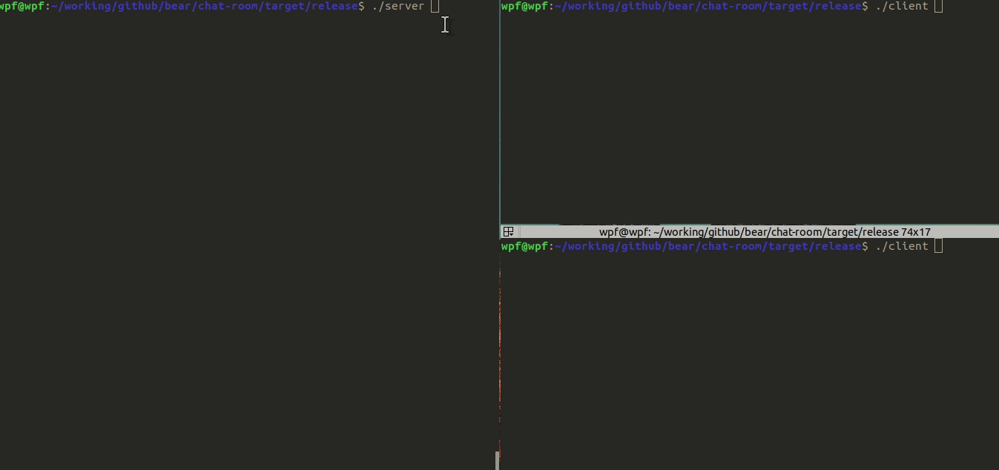

# chat-room

A chat room written in Rust.

## Install

Make sure you had installed rustup

It's time to have a try:

1. Clone the repository
2. Run `Cargo build --release`
3. Change the directory to `target/release`

